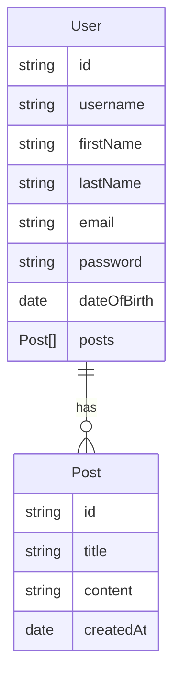

# Entities

```mermaid
erDiagram
    User {
        string id
        string username
        string firstName
        string lastName
        string email
        string password
        date dateOfBirth
        Post[] posts
    }
    Post {
        string id
        string title
        string content
        date createdAt
    }
    User ||--o{ Post : has
```